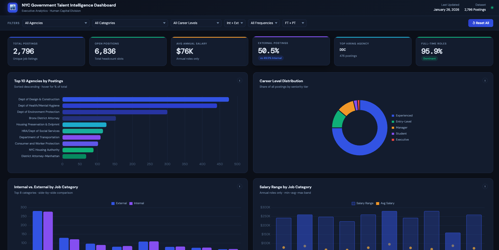

# 🏙️ NYC Government Talent Intelligence Dashboard

> A fully interactive, executive-grade analytics dashboard built from 2,796 NYC government job postings — powered by a single, well-crafted AI prompt using **Claude by Anthropic**.

**🔴 Live Demo → [View Dashboard](https://viru9192.github.io/NYC_Talent_Dashboard/)**



---

## 📌 Project Overview

This project transforms raw NYC government hiring data into a **boardroom-ready intelligence tool** — designed for executives who need fast, clear answers before walking into a budget or workforce planning meeting.

Built entirely in a **single self-contained HTML file** with no npm, no build step, and no external data calls. Everything works offline after the initial CDN load.

---

## 🎯 Who Is This For?

| Role | Use Case |
|------|----------|
| **CEO / CFO** | Understand headcount budget exposure, hiring surges, and salary benchmarks before a meeting |
| **HR Leaders** | Identify which agencies dominate hiring and which career levels are underserved |
| **Data Analysts** | Study prompt engineering and AI-assisted dashboard generation |
| **Recruiters** | Benchmark NYC government salary ranges by job category |

---

## 📊 Dataset

| Field | Detail |
|-------|--------|
| **Source** | NYC Government Job Postings (Open Data) |
| **Records** | 2,796 unique job postings |
| **Columns** | 30 fields |
| **Key Fields** | Agency, Job Category, Career Level, Salary Range, Posting Type, # of Positions, Posting Date |
| **File** | `Jobs_NYC_Postings.csv` |

---

## 🧠 Key Metrics at a Glance

| KPI | Value |
|-----|-------|
| Total Job Postings | 2,796 |
| Total Open Positions | 6,836 |
| Average Annual Salary | $76,096 |
| External Postings | 50.5% |
| Full-Time Roles | 95.9% |
| Top Hiring Agency | Dept of Design & Construction (476 postings) |
| Unique Agencies | 63 |

---

## 📈 Dashboard Features

### 🔍 Global Filter Bar (Sticky)
Filter everything dynamically across all charts with dropdowns for:
- Agency
- Job Category
- Career Level
- Posting Type (Internal / External)
- Salary Frequency (Annual / Hourly / Daily)
- Full-Time / Part-Time
- **Reset All** button to clear filters instantly

---

### 📦 10 Interactive Charts

| # | Chart | Type | Business Question Answered |
|---|-------|------|---------------------------|
| 1 | Top 10 Agencies by Postings | Horizontal Bar | Which agencies are hiring the most? |
| 2 | Career Level Distribution | Donut | What is the seniority mix across all postings? |
| 3 | Internal vs. External by Category | Grouped Bar | Which domains favor internal mobility vs. outside hires? |
| 4 | Salary Range by Category | Floating Bar | What is the salary exposure per function? |
| 5 | Open Positions by Agency | Stacked Bar | Which agencies need the most headcount? |
| 6 | Posting Activity Over Time | Area Line | When are hiring surges happening? Seasonal or structural? |
| 7 | Job Category Share | Treemap | Which categories dominate the talent pipeline? |
| 8 | Salary From vs. Salary To | Scatter Plot | How wide are salary bands across career levels? |
| 9 | Agency × Month Heatmap | CSS Heatmap | Which agencies post most heavily in which months? |
| 10 | Career Mix Radar | Spider/Radar | How does each top agency's seniority profile compare? |

---

### 💡 Auto-Generated Insights Panel
A dynamic section at the bottom surfaces **5 data-driven observations** based on the currently filtered view — similar to an AI analyst summarizing the data for you before a meeting.

---

## 🛠️ Tech Stack

| Technology | Purpose |
|-----------|---------|
| **HTML5 / CSS3** | Single-file structure and styling |
| **Chart.js v4** | Bar, line, donut, scatter, radar charts |
| **D3.js v7** | Treemap visualization |
| **CSS Grid** | Heatmap rendering |
| **Google Fonts** | DM Sans + DM Mono typography |
| **Vanilla JavaScript** | Filter logic, aggregations, dynamic updates |

> ✅ No npm. No build tools. No external API calls. Works fully offline after CDN load.

---

## 🚀 How to Run Locally

```bash
# Clone the repo
git clone https://github.com/viru9192/NYC_Talent_Dashboard.git

# Open the dashboard
cd NYC_Talent_Dashboard
open index.html
```

Or simply **[view it live here](https://viru9192.github.io/NYC_Talent_Dashboard/)** — no setup needed.

---

## 🤖 How This Was Built — The Prompt Engineering Story

This entire dashboard was generated using a **single, structured prompt** to Claude (Anthropic). The prompt was not "make me a dashboard." It was a precisely engineered instruction that defined:

- ✅ **Audience** — CEO & CFO, not data analysts. Executive-grade output required.
- ✅ **Dataset context** — Described all 30 fields and what they represent
- ✅ **Chart selection** — Specified which chart type answers which business question
- ✅ **Design system** — Defined the exact color palette (`#0A1628` bg, `#2563EB` accent), font, and layout grid
- ✅ **Technical constraints** — Single HTML file, no npm, no build step, offline-capable
- ✅ **Insight logic** — Instructed AI to auto-generate 5 observations from filtered data

### What I Learned

> **Lesson 1:** Prompting is structured thinking, not typing.
>
> **Lesson 2:** The clearer your context, the smarter the output.
>
> **Lesson 3:** Constraints aren't limits — they're design decisions.

The quality of the dashboard was a direct reflection of the quality of the thinking that went into the prompt. AI doesn't replace analytical skill. It amplifies it.

---

## 💼 Executive Use Case — Why This Matters

Imagine a **CEO and CFO walking into a budget meeting in 20 minutes**.

They need fast answers to:

- Which agencies are burning headcount budget the fastest?
- Are we over-hiring at entry level while starving managerial roles?
- What's our average salary exposure across Engineering vs. Legal vs. Technology?
- Is our talent pipeline external-heavy, or are we promoting from within?
- Where is hiring surging — and is it seasonal or structural?

With this dashboard: **open one file → click one filter → every answer is on screen.**

No pivot tables. No analyst on speed dial. No *"let me pull that report."*

---

## 📁 Repository Structure

```
NYC_Talent_Dashboard/
│
├── index.html                  # Complete self-contained dashboard
├── Jobs_NYC_Postings.csv       # Source dataset (2,796 records)
├── Claude_Job_Postings.png     # Dashboard preview image
└── README.md                   # This file
```

---

## 🔗 Connect

Built by **[Virendra Maurya](https://github.com/viru9192)**

If you're a recruiter, data professional, or hiring manager interested in analytical work that bridges AI tooling with real business decision-making — let's connect on [LinkedIn](https://www.linkedin.com/in/).

---

## ⭐ If you found this useful

Give the repo a **star** — it helps others discover the project and shows what's possible with thoughtful prompt engineering.

---

*Built with Claude by Anthropic · Dataset: NYC Open Data · April 2026*
